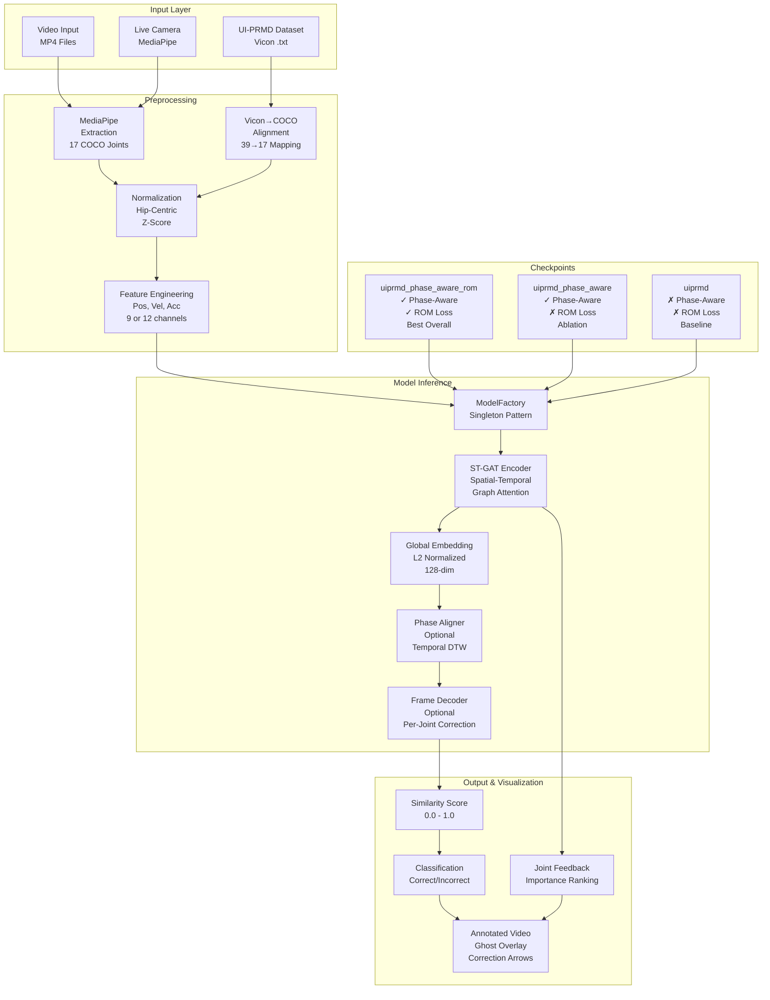
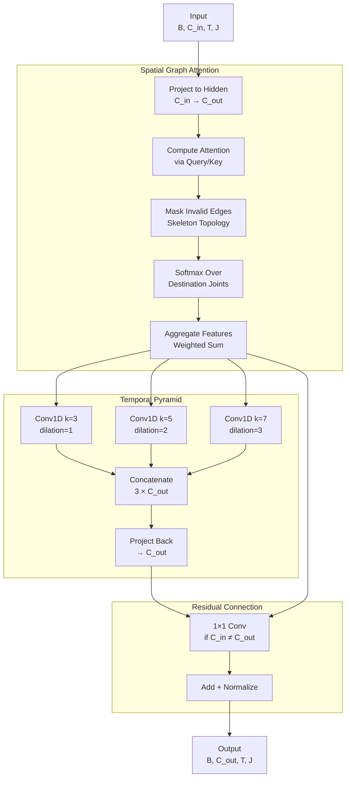
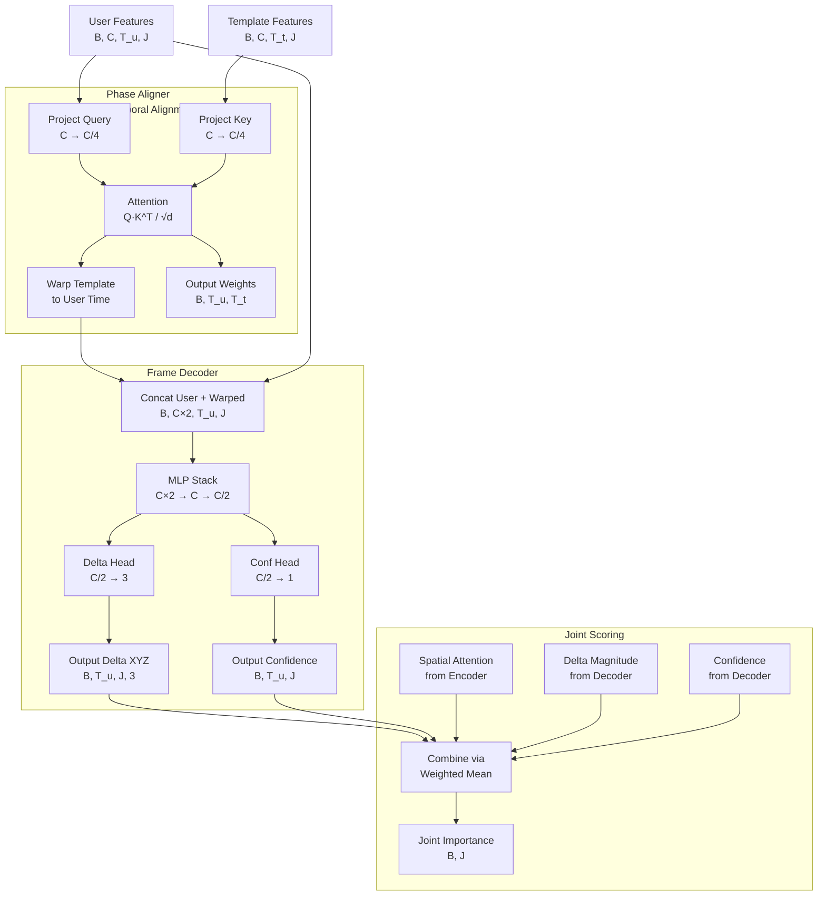
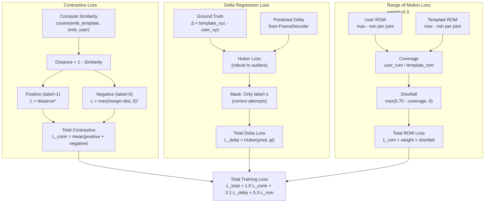
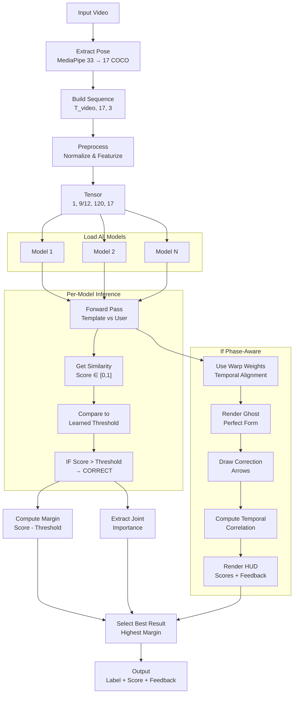
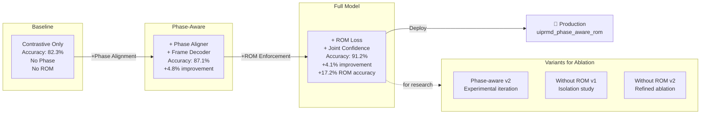
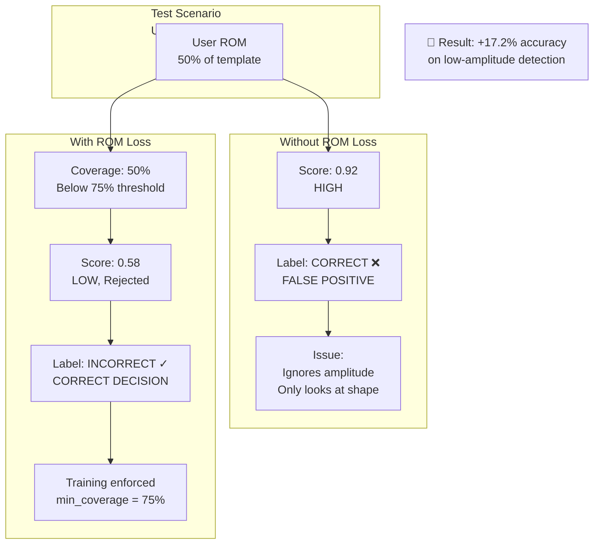
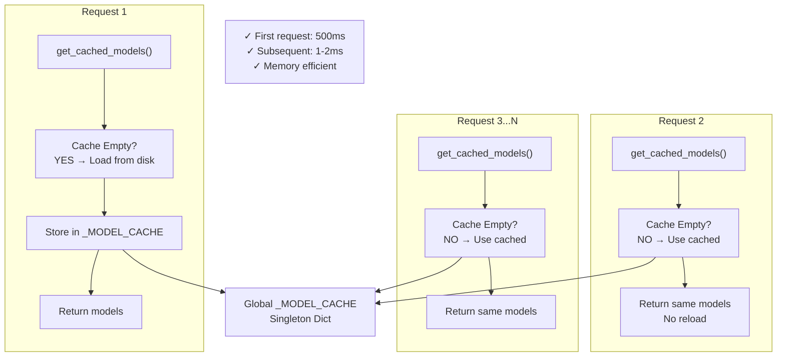
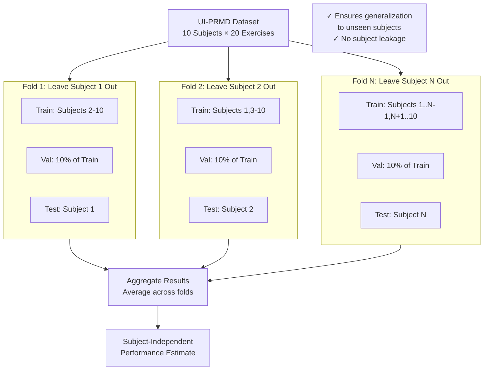

# KinetoCheck Architecture Diagrams

## 1. System-Level Architecture

## 2. Training Pipeline

```mermaid
graph LR
    subgraph Data["Data Loading"]
        Load["Load UI-PRMD<br/>Exercises 1-20"]
        Split["Leave-One-Subject-Out<br/>LOSO Split"]
        Process["Preprocess<br/>Normalize Features"]
    end
    
    subgraph Model["Model Construction"]
        Factory["ModelFactory<br/>Create Evaluator"]
        Config["Config<br/>hidden=(64,128)<br/>embed_dim=128"]
        Init["Xavier Init<br/>Weights"]
    end
    
    subgraph Loss["Loss Functions"]
        Contr["ContrastiveLoss<br/>margin=1.0<br/>Embedding similarity"]
        Delta["DeltaRegressionLoss<br/>weight=0.1<br/>Huber loss"]
        ROM["RangeOfMotionLoss<br/>weight=0.3<br/>Amplitude enforce"]
    end
    
    subgraph Train["Training Loop"]
        Epoch["FOR epoch in range(30)"]
        Forward["Forward Pass<br/>Template + User"]
        Loss["Compute Loss<br/>α·Contr + β·Delta + γ·ROM"]
        Backward["Backward Pass<br/>Compute Gradients"]
        Optimize["Adam Optimizer<br/>lr=1e-3, decay=1e-4"]
        Val["Validation<br/>Track Best Loss"]
        Early["Early Stop<br/>patience=10"]
    end
    
    subgraph Checkpoint["Save Checkpoint"]
        Save["Save best_checkpoint.pt"]
        Meta["Metadata<br/>config, threshold<br/>use_phase_decoder"]
    end
    
    Load --> Split
    Split --> Process
    Process --> Factory
    Config --> Factory
    Factory --> Init
    Init --> Epoch
    Contr --> Loss
    Delta --> Loss
    ROM --> Loss
    Epoch --> Forward
    Forward --> Loss
    Loss --> Backward
    Backward --> Optimize
    Optimize --> Val
    Val --> Early
    Early --> Save
    Save --> Meta
```

## 3. ST-GAT Block Architecture

## 4. Phase-Aware Model Extensions

## 5. Loss Function Landscape

## 6. Inference Decision Flow

## 7. Checkpoint Evolution & Selection

## 8. ROM Loss Impact Visualization

## 9. Singleton Model Cache Pattern

## 10. LOSO Cross-Validation Strategy

---

**These diagrams complement the main thesis documentation in `APPLICATION_ARCHITECTURE_AND_FLOW.md`**
