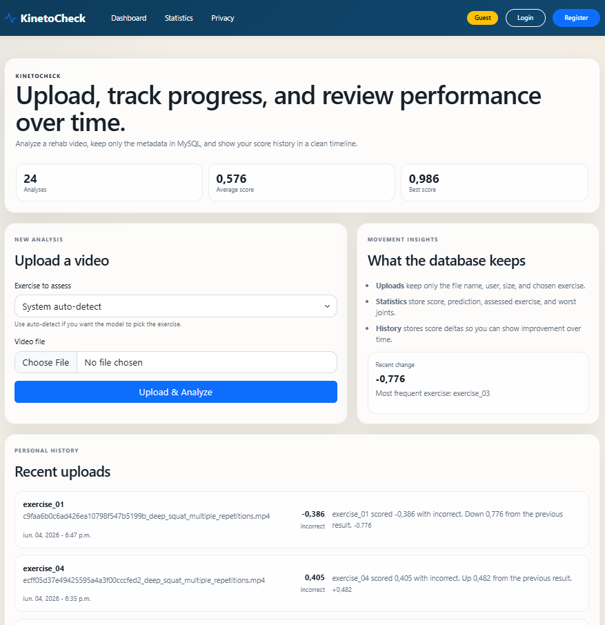
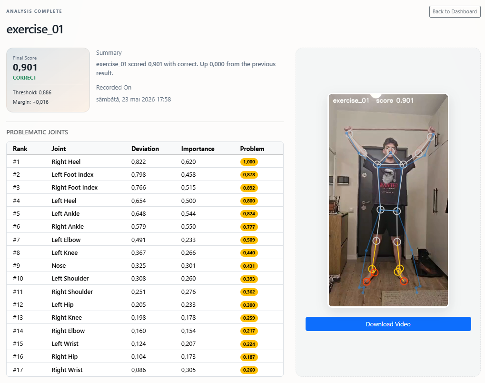

# KinetoCheck


**KinetoCheck** is an AI-assisted platform designed to evaluate physical rehabilitation movement quality using standard RGB cameras. Developed as a Bachelor Thesis project, it transcends traditional pass/fail binary classification by providing patients and clinicians with a continuous quality score and highly interpretable, biomechanical visual feedback.

 *(Add your annotated video/skeleton screenshot here)*

## 📖 Project Overview

Physical rehabilitation is critical for restoring mobility, but home routines often suffer from a lack of expert supervision. KinetoCheck solves this by leveraging a dual-stream deep learning architecture:
1. **Spatio-Temporal Graph Attention Networks (ST-GAT)** to analyze spatial body topology.
2. **1D-CNN Temporal Pyramids** to capture joint-angle temporal dynamics (velocity, acceleration).

Trained on the **UI-PRMD** dataset, the system utilizes a Siamese contrastive learning approach to compare user executions against expert templates. Furthermore, an advanced **Phase-Aware Diagnostic Engine** aligns timelines via soft Dynamic Time Warping (DTW) and explicitly identifies "Joints of Attention" (JoA) to explain *why* an exercise was flagged as incorrect.

## ✨ Key Features

* **Phase-Aware Explainable AI (XAI):** Doesn't just score movements; it maps attention weights and spatial error deltas back to the skeleton to highlight specific failing joints.
* **Ghost Skeleton Overlay:** Generates a temporally aligned, anatomically scaled visual overlay of the "perfect" movement directly on the user's video.
* **Range of Motion (ROM) Regularization:** Auxiliary loss networks specifically designed to detect and penalize "partial rep" executions.
* **Auto-Detect Multi-Model Inference:** Concurrently evaluates a video against multiple exercise checkpoints to automatically determine which exercise is being performed.
* **Longitudinal Patient Tracking:** A secure ASP.NET Core web dashboard backed by Entity Framework Core and MySQL to track recovery trends over time.

## 📂 Repository Structure

The project is strictly separated into a Python Machine Learning backend and a C# MVC frontend.

```text
KinetoCheck/
├── AI/                                  # Python / PyTorch Inference Engine
│   ├── api.py                           # FastAPI entry point
│   ├── app/                             # Core inference and routing logic
│   ├── checkpoints/                     # Pre-trained model weights (.pt files)
│   ├── FeaturePipelines/                # 12-channel kinematic feature engineering
│   ├── Models/                          # ST-GAT, Phase Aligner, Frame Decoder definitions
│   ├── Preprocessing/                   # MediaPipe to 17-joint mapping & normalization
│   └── tmp_api_uploads/                 # Ephemeral storage for video processing
│
├── App/                                 # C# / ASP.NET Core Web Dashboard
│   ├── Controllers/                     # MVC routing (Home, Account, Analysis)
│   ├── Data/                            # Entity Framework Core DbContext
│   ├── Migrations/                      # SQL schema migrations
│   ├── Models/                          # Domain entities (Upload, JointInsight, etc.)
│   ├── ViewModels/                      # Aggregated statistics for tracking
│   ├── Views/                           # Razor HTML/CSS/Bootstrap frontend
│   └── Program.cs                       # .NET application bootstrapping
│
├── Datasets/                            # Local storage for UI-PRMD / Vicon data
├── KinetoCheck.sln                      # Visual Studio Solution File
└── README.md
``` 
🚀 Getting Started
Prerequisites
Python 3.10+ (with a CUDA-enabled GPU highly recommended)

.NET 8.0 SDK

MySQL Server (Running locally or via Docker)

1. Running the AI Backend (FastAPI)
The AI backend acts as a microservice that the web application talks to. It handles video pose extraction, temporal alignment, and ST-GAT inference.

```Bash
# Navigate to the AI directory
cd AI

# Activate your virtual environment (Windows)
.venv\Scripts\activate

# Install requirements (if not already done)
pip install -r requirements.txt

# Run the FastAPI server
python -u api.py
```
The API will be available at http://localhost:8000. You can view the Swagger documentation at http://localhost:8000/docs.

2. Running the Web Frontend (ASP.NET Core)
The frontend provides the clinical dashboard, user authentication, and upload interfaces.

```Bash
# Open a new terminal and navigate to the App directory
cd App

# Apply Entity Framework database migrations to your MySQL instance
dotnet ef database update

# Run the web application
dotnet run
```
The web dashboard will be available at http://localhost:5000 (or the port specified in your console).





🧠 Architectural Highlights
The Inference Pipeline
Pose Extraction: RGB videos are processed using MediaPipe to extract 33 landmarks, which are reduced to a 17-joint COCO-compatible topology.

Geometric Normalization: Skeletons are translation-invariant (pelvis-centered) and scale-invariant (torso-normalized) to prevent "identity leakage" where the AI memorizes patient height instead of movement quality.

12-Channel Representation: Raw spatial coordinates (XYZ) are augmented with velocity, acceleration, joint angles, and angular velocities.

Siamese Evaluation: The ExerciseEvaluator compares the user's sequence to a template using graph attention blocks and temporal dilated convolutions to produce a final Euclidean/Cosine similarity score.

🎓 Academic Context
This repository constitutes the practical implementation for the Bachelor's Thesis:
"Assessment of Physical Rehabilitation Exercises using Deep Learning and Computer Vision"
Babeș-Bolyai University, Faculty of Mathematics and Computer Science (2026).

Author: Alexe Nicolae Răzvan
Supervisor: Lect. Dr. Iuliana Bocicor
